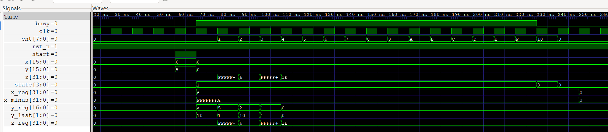

# Booth乘法器设计

## Booth乘法器算法流程图

## 调试报告

**一些说明**

1. `x` 为 16 位但是 `x_reg` 使用 32 位，是为了方便 `x` 和 `x_minus` 和 `z_reg` 位数长度一致，能够直接相加运算。
2. 代码中有 `signed` 关键字，因为上面一点，用 `x` 给 `x_reg` 赋值的时候需要特殊处理符号位，即给 `x` 做符号位扩展；使用 verilog 的 `signed` 可以自动处理符号位扩展。
3. `y_reg` 比 `y` 多一位，末位为添加的辅助位（即 $y_{-1}$）

**调试报告**

1. `5*6=30`

   

   1. `y_reg` 初始化为 `y<<1`：在 start 后的第一周期， `y_reg = 0xA, == 0x5 << 1`
   2. `y_last` 序列为 `10/01/10/01/00...`，所以 `z_reg = (-x<<0)+(x<<1)+(-x<<2)+(x<<3)`
   3. `x_minux = -x` 为 `-x` 的补码 `0xFFFFFFFA`
   4. `z_reg` 为部分积，将会保留到下次 `start`

2. `(-6)*5=-30`

   

   1. `y_reg` 初始化为 `5<<1=0xFFFFFFFA`
   2. `y_last` 序列同上1.，所以 `z_reg = (-x<<0)+(x<<1)+(-x<<2)+(x<<3)`
   3. `x_minus = -x = 6`
   4. 结果为 `0xFFFFFFE2 = -30`

3. `0x1234*0x1234=0x14B5A90`

   

   1. `y_reg` 初始化为 `0x1234<<1 = 0x2468`
   2. `y_reg` 每次右移一位，得 `0x2468, 0x1234, 0x91A, ...`
   3. `x_minus = -x = 0xFFFFEDCC`
   4. 结果为 `0x14B5A90`

由上可知，在此实现的 `booth` 算法可以在 `WIDTH` 时间周期内得到两个 `WIDTH` 宽的有符号整形补码的乘积的值。